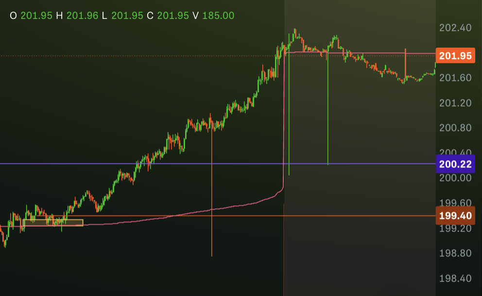

*we back.*

*after years off the blog — new family, blown account, life doing*
*what life do — we back. and what better way to reintroduce ourselves*
*than a red day.*

<Giphy url="https://giphy.com/gifs/friday-movie-bernie-mac-3o7aTJowF5qDTwJYYg&#x22;](https://giphy.com/gifs/friday-movie-bernie-mac-3o7aTJowF5qDTwJYYg" />

real ones know. the market don't care about your feelings or your hiatus.

---

### THE APPROACH GOING IN

today was always gonna be **fact finding mode.**

that's what one of the admins in our trading group always says going
into Monday and honestly? it's facts. Monday is not the day to be a
hero. market's still figuring itself out from the weekend gap, big
money is repositioning, and you out here tryna catch a move that ain't
developed yet.

so the plan was simple:

* size down ✅
* take less trades ✅
* be patient ✅✅... mostly

---

### THE MISS THAT HURT THE MOST (AND I DIDN'T EVEN TAKE IT)

$META sitting in a **Weekly AND Monthly Bearish FVG**.

that's a higher timeframe short setup that don't come around every
week. i been watching it.

i hesitated. market been strong. it's genuinely hard to time shorts
when the tape is sticky to the upside and i talked myself out of it.

*filed that one under "trust the levels next time."*

---

### THE AAPL PUTS — JUMPED THE GUN 🔫

**09:32 — AAPL 270 PUT, Apr 24 exp**
**11:30 — AAPL 272.5 PUT, Apr 24 exp**

first one, i entered at **9:32.** before the 30 minute opening range
even formed.

<Giphy url="https://giphy.com/embed/RgnTXvE24wFjUhB3Dt" />

classic. i KNOW better. the 30 min ORB exists for a reason — it tells
you where the battleground is. i skipped that step, got in early, and
spent the rest of the day watching theta eat me alive while the
position recovered from **-$250+** all the way back to near flat.

and then... we did get the drop i was looking for. contracts were too
burnt by then to make real money.

the second put i stopped out of early. **-$18.66.**

total on AAPL: **-$142.65**

the trade idea wasn't wrong. the entry was wrong. there's a difference.

---

### THE NVDA SITUATION — 📈💀

this one.

*this one right here.*

<Giphy url="https://giphy.com/embed/NQywixima1mrEyRC1X" />

**12:24 — NVDA 200 CALL, 0DTE**
*10 contracts @ $0.30/ea = $300 in*

admin dropped a signal. NVDA broke VWAP, held the FVG, structure
was clean.

i got in.

and then i watched the contracts get volatile and i panicked. cut em
way too early. took **-$80.**

\
*exited at the red line*

you know what those contracts did after i cut em?

*zoomed.*

held structure the whole way up. never touched my risk level. not once.\
\

by end of day?

**$300 a contract.**

i paid **$0.30.**

\<!-- IMAGE: contract price at EOD — $3.00+ -->

10 contracts × $300 = **$3,000.**

i left **$2,500+ on the table** in the small account.\\

<Giphy url="https://giphy.com/gifs/mrw-month-middle-yIxNOXEMpqkqA" />

i think i got spooked. small account, volatile 0DTE contracts moving
30-40% against me and i blinked. but the levels never broke. the
thesis was right. i just didn't trust it.

that's the lesson. not "0DTE bad." it's **trust the levels you**
**identified or don't take the trade.**

---

### END OF DAY

called it after NVDA. wasn't in the right headspace to keep going
and i know better than to revenge trade.

still holding the **ARM 180 CALL** (Apr 24 exp) from 1:31pm.
that one's open. will update.

**NET P\&L: -$251.31**
5 trades. 0 winners. 3 losers.

---

## POST GAME 💰⛹🏿‍♂️

##### SO WHAT DID WE LEARN

* **WAIT FOR THE 30 MINUTE ORB BEFORE ENTERING.** knew this.
  violated it anyway. cost us. no more.
* **TRUST THE LEVELS OR DON'T TAKE THE TRADE.** NVDA never broke
  structure. i broke first. that's a discipline issue, not a
  market issue.
* **FACT FINDING MONDAYS ARE REAL.** sized down, took less trades,
  didn't blow up. considering how Monday usually goes — that part
  was a W even if the P\&L wasn't.
* **THE META SHORT IS STILL THERE.** higher timeframe setups don't
  disappear overnight. keep watching.

we back. and the blog is back. -$251 is an expensive welcome home
gift but the lessons are free.

see you tomorrow. 🎲
